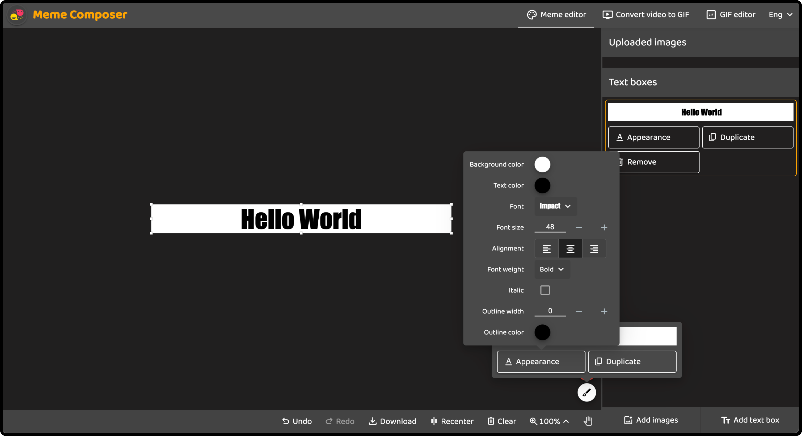

# angular-anchored-floating-box

A singleton, global Angular service to programmatically render a floating box anchored at an element that can have arbitrary content specified by either a `TemplateRef` or `@Component`.

## Installation

- `npm`
  ```
  npm i -S @babybeet/angular-anchored-floating-box
  ```
- `pnpm`
  ```
  pnpm i -S @babybeet/angular-anchored-floating-box
  ```
- `yarn`
  ```
  yarn add @babybeet/angular-anchored-floating-box
  ```

## Available APIs

These are the symbols that are available from this package

```typescript
/**
 * This class allows to show a floating box anchored at an element.
 * See `AnchoredFloatingBoxConfiguration` for the different
 * options to configure the floating box.
 */
class AnchoredFloatingBoxService {
  /**
   * Set the default theme that will be used for all floating boxes created in the future.
   *
   * @param theme The new theme to be used as the default.
   */
  static setDefaultTheme(theme: Theme): void;

  /**
   * Open a new floating box with a configuration object specified by `configuration`. This service
   * supports rendering `TemplateRef` as well as any `@Component()` class.
   *
   * @param configuration The configuration object for the anchored floating box
   *
   * @returns A ref object used to interact with the created floating box.
   */
  open(configuration: AnchoredFloatingBoxConfiguration): AnchoredFloatingBoxRef;
}
```

<br/>

```typescript
/**
 * The configuration object for the current anchored floating box.
 * The type parameter `C` describes the type of the optional
 * context object passed to `TemplateRef<C>`.
 */
interface AnchoredFloatingBoxConfiguration<C extends Record<string, unknown> | unknown = unknown> {
  /**
   * The required element that the floating box will be anchored to.
   */
  anchor: Element;

  /**
   * The optional class name to add to the anchored floating box's container.
   */
  className?: string;

  /**
   * The required content to show, it accepts `TemplateRef` as well as any `@Component()` class.
   */
  content: TemplateRef<C> | Type<unknown>;

  /**
   * The optional context object that is referenced by the template ref.
   */
  context?: C;

  /**
   * The optional theme for the floating box. Default is `Theme.LIGHT`.
   */
  theme?: Theme;
}
```

<br/>

```typescript
const enum Theme {
  LIGHT = 'light',
  DARK = 'dark'
}
```

<br/>

```typescript
/**
 * A reference to the opened anchored floating box that can be used to
 * close it, or to add the listeners to be invoked depending on
 * whether the floating box is opened or closed.
 */
class AnchoredFloatingBoxRef {
  /**
   * Close this anchored floating box only.
   */
  close(): void;

  /**
   * Add a callback to be invoked after the floating box is closed.
   */
  addAfterClosedListener(listener: () => void): void;

  /**
   * Add a callback to be invoked after the floating box is opened.
   */
  addAfterOpenedListener(listener: () => void): void;
}
```

## Example Usage

### Code example

```typescript
// Import the service into your class to start using it
import { AnchoredFloatingBoxService } from '@babybeet/anchored-floating-box';

@Component({
  selector: 'test-component',
  template: `
        <button
                #button
                type='button'
                (click)='onOpen(template, button)'>
                Click me
        </button>
        <ng-template
                #template
                let-name <-- The context['$implicit'] from below
                let-greeting='greeting'> <-- The context.greeting from below
            {{greeting}} {{name}}
        </ng-template>
    `
})
export class TestComponent {
  constructor(private readonly anchoredFloatingBoxService: AnchoredFloatingBoxService) {}

  onOpen(templateRef: TemplateRef<any>, anchor: HTMLButtonElement) {
    this.anchoredFloatingBoxService.open({
      content: templateRef,
      anchor,
      className: 'optional-class-name',
      context: {
        greeting: 'Hello',
        $implicit: 'Angular!!!'
      }
    });
  }
}
```

### Result

- Light theme
  

- Dark theme
  

<br/>

It will also reposition itself if it overflows the top or bottom edge of the viewport like so.


<br/>

<br/>

# Real world example

Below is a screenshot of a personal app of mine at [https://memecomposer.com](https://memecomposer.com) that uses this component. Clicking on the brush icon button popped open an anchored floating box, then clicking "Text appearance" button inside of it opened another anchored floating box that is independent of the previous one and any others.


